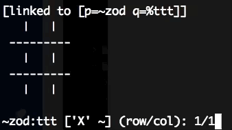

# TIC-TAC-TOE in Hoon

This is an homage to [urbit's](https://urbit.org/) tic-tac-toe [app](https://www.youtube.com/watch?v=_acTt4_IXYM&t=225s), based on the [example](https://github.com/joshuareagan/doc-drafts/blob/master/Hoon-Ch2-10.md) written by Joshua Reagan (aka ~taglux-nidsep)

## Docs

TODO

## Features

- Network multiplayer. [Done! check [network](https://github.com/josl/tic-tac-toe/tree/network) branch for updates]
- Board state printed in the console
- Structures in `/=home=/sur` and marks for updates
- Notification for game invitation
- Uses queue instead of list to keep track on subscriptions on hold
  - Research Gall to replace this
- Pending requests to play are queued and pulled one current game finishes.
## Network install

    |sync %toe ~norsyr-torryn %toe

## Local install

TODO

## Get started!

In your urbit's Dojo, run the command:

    ~your-urbit:dojo> |start %toe

## In Progress
- Refactor code (remove redundant code)
- Follow `/=home=/gen/deco.hoon` best-coding practices
- Improve game state transtition
  - Use a door for `++  game-engine`
## TODO
- Partial board re-paint on each move.
- Web frontend
- Both apps need to be running before sending request to play
- Single-player mode
- Follow [code style](https://urbit.org/docs/learn/arvo/style/)

## References

- https://github.com/joshuareagan/doc-drafts/blob/master/Hoon-Ch2-10.md
- https://urbit.org/
- https://www.youtube.com/watch?v=_acTt4_IXYM
